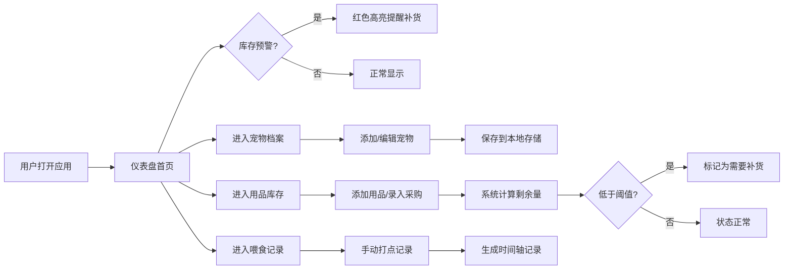

## 1. 产品概述

宠物用品管理工具是一款帮助宠物主人系统化管理宠物档案、用品库存和日常护理记录的Web应用。通过直观的界面，用户可以轻松追踪宠物健康信息、监控用品消耗、及时补货，以及记录喂食喂药时间。

- 核心价值：解决宠物主人忘记补货、记录混乱、喂食时间不规律等痛点
- 目标用户：养有多只宠物的家庭、宠物爱好者、宠物寄养机构

## 2. 核心功能

### 2.1 用户角色
| 角色 | 注册方式 | 核心权限 |
|------|---------|---------|
| 普通用户 | 无需注册，本地存储 | 全部功能访问与数据管理 |

### 2.2 功能模块
1. **仪表盘首页**：库存预警概览、今日待办提醒、快速操作入口
2. **宠物档案管理**：宠物信息增删改查（种类、品种、体重、生日、照片）
3. **用品库存管理**：用品分类管理、库存记录、购买历史、阈值提醒
4. **喂食喂药记录**：时间轴记录、手动打点、历史查询

### 2.3 页面详情
| 页面名称 | 模块名称 | 功能描述 |
|---------|---------|---------|
| 仪表盘 | 预警卡片 | 显示低于阈值的用品列表，突出红色提醒 |
| 仪表盘 | 数据统计 | 宠物数量、用品种类、库存预警数统计 |
| 仪表盘 | 快捷操作 | 一键添加喂食/喂药记录、快速录入采购 |
| 宠物档案 | 宠物列表 | 卡片式展示所有宠物，支持筛选搜索 |
| 宠物档案 | 新增/编辑 | 表单录入宠物信息：种类、品种、体重、生日、备注 |
| 用品库存 | 用品列表 | 分类标签页展示：主粮、罐头、零食、猫砂、尿垫、驱虫药、其他 |
| 用品库存 | 库存详情 | 显示剩余量、购买量、最低阈值、补货提醒状态 |
| 用品库存 | 入库操作 | 记录采购量、单价、购买日期，自动更新剩余量 |
| 用品库存 | 出库操作 | 记录消耗量，自动扣减剩余量 |
| 喂食喂药 | 时间轴 | 按时间倒序展示所有喂食/喂药记录 |
| 喂食喂药 | 快速打点 | 一键记录当前时间喂食/喂药，可选关联宠物和用品 |

## 3. 核心流程

## 4. 用户界面设计

### 4.1 设计风格
- **主色调**：温暖的奶油橙 (#FF8C42) 搭配柔和的薄荷绿 (#4ECDC4)，体现宠物主题的温馨与活力
- **辅助色**：暖米色背景 (#FFF8F0)、深炭灰文字 (#2D3436)
- **按钮风格**：圆润大圆角 (12px)，微阴影，悬停有轻微上浮动效
- **字体**：标题使用「ZCOOL KuaiLe」圆润可爱字体，正文使用「Noto Sans SC」清晰易读
- **布局风格**：卡片式布局，大量留白，柔和阴影营造层次感
- **图标风格**：可爱的宠物主题emoji + SVG线性图标，每个用品分类有专属图标

### 4.2 页面设计概述
| 页面名称 | 模块名称 | UI元素 |
|---------|---------|--------|
| 仪表盘 | 预警卡片 | 渐变背景卡片，脉冲动画提醒，补货按钮 |
| 仪表盘 | 统计卡片 | 圆角卡片，大号数字，渐变色背景 |
| 仪表盘 | 快速操作 | 大图标按钮网格，点击缩放反馈 |
| 宠物档案 | 宠物卡片 | 头像+基本信息，悬停展开更多详情 |
| 用品库存 | 分类标签 | 胶囊状标签，选中高亮填充色 |
| 用品库存 | 库存进度条 | 彩色进度条显示剩余量占比 |
| 用品库存 | 预警状态 | 红色角标 + 抖动动画 |
| 喂食记录 | 时间轴 | 左侧竖线连接，圆点标记，卡片交错布局 |
| 喂食记录 | 打点按钮 | 大号圆形按钮，脉冲波纹效果 |

### 4.3 响应式
- 桌面端优先设计（≥1280px），三栏布局
- 平板端（768-1279px）：两栏布局，侧边栏折叠
- 移动端（<768px）：单列布局，底部Tab导航
- 所有触控目标最小尺寸 44px，优化滑动体验
