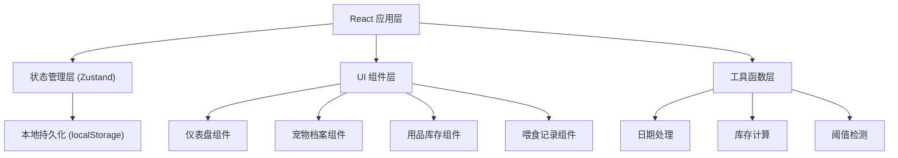
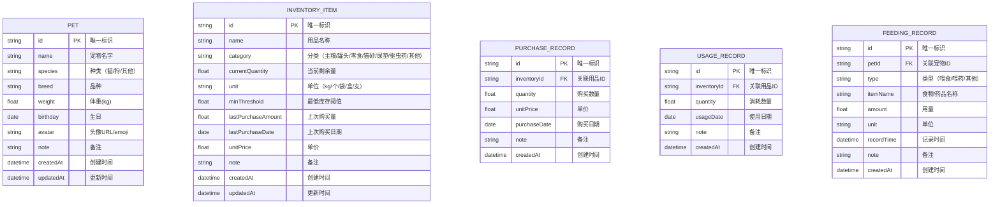

## 1. 架构设计



## 2. 技术描述
- **前端框架**：React@18 + TypeScript
- **构建工具**：Vite@5
- **样式方案**：TailwindCSS@3 + CSS变量主题系统
- **状态管理**：Zustand（轻量级，内置持久化中间件）
- **图标库**：Lucide React（线性图标，风格统一）
- **日期处理**：date-fns（轻量日期工具库）
- **后端**：无后端，纯前端本地存储
- **数据持久化**：localStorage（JSON序列化存储）

## 3. 路由定义
| 路由 | 用途 |
|-----|------|
| /dashboard | 仪表盘首页 - 预警概览与快捷操作 |
| /pets | 宠物档案管理 |
| /inventory | 用品库存管理 |
| /feedings | 喂食喂药记录 |

## 4. 数据模型

### 4.1 数据模型定义



### 4.2 数据存储结构

```typescript
// localStorage 存储键
const STORAGE_KEYS = {
  PETS: 'pet_manager_pets',
  INVENTORY: 'pet_manager_inventory',
  PURCHASES: 'pet_manager_purchases',
  USAGES: 'pet_manager_usages',
  FEEDINGS: 'pet_manager_feedings'
};

// 用品分类枚举
type InventoryCategory = 'food' | 'can' | 'snack' | 'litter' | 'pad' | 'dewormer' | 'other';

// 宠物种类枚举
type PetSpecies = 'cat' | 'dog' | 'rabbit' | 'bird' | 'fish' | 'other';
```

## 5. Zustand Store 设计

```typescript
interface PetStore {
  pets: Pet[];
  inventory: InventoryItem[];
  purchases: PurchaseRecord[];
  usages: UsageRecord[];
  feedings: FeedingRecord[];
  
  // 宠物操作
  addPet: (pet: Omit<Pet, 'id' | 'createdAt' | 'updatedAt'>) => void;
  updatePet: (id: string, data: Partial<Pet>) => void;
  deletePet: (id: string) => void;
  
  // 库存操作
  addInventory: (item: Omit<InventoryItem, 'id' | 'createdAt' | 'updatedAt'>) => void;
  updateInventory: (id: string, data: Partial<InventoryItem>) => void;
  deleteInventory: (id: string) => void;
  recordPurchase: (inventoryId: string, quantity: number, unitPrice: number, note?: string) => void;
  recordUsage: (inventoryId: string, quantity: number, note?: string) => void;
  
  // 喂食操作
  addFeeding: (record: Omit<FeedingRecord, 'id' | 'createdAt'>) => void;
  deleteFeeding: (id: string) => void;
  
  // 计算属性
  getLowStockItems: () => InventoryItem[];
  getInventoryByCategory: (category: InventoryCategory) => InventoryItem[];
}
```

## 6. 核心业务逻辑

### 6.1 库存阈值检测
```
阈值检查规则：
- currentQuantity <= minThreshold → 需要补货（红色预警）
- currentQuantity <= minThreshold * 1.5 → 即将不足（黄色提醒）
- 其他情况 → 库存充足（绿色正常）
```

### 6.2 库存数量更新
```
采购入库：
  currentQuantity = currentQuantity + purchaseQuantity
  lastPurchaseAmount = purchaseQuantity
  lastPurchaseDate = today

消耗出库：
  currentQuantity = max(0, currentQuantity - usageQuantity)
```
